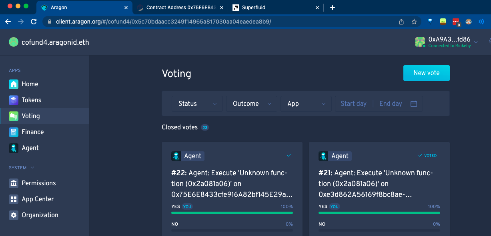

# Cofund

Vote, Fund, Deliver.

Cofund is a new framework that bridges the **voting & funding processes** for large DAO project using **NFTs**, **Superfluid streams**, and **Aragon client**.

## Submission

This repo contains the smart contracts for the prototype of the Cofund app that we built in the DAO Global Hackathon.

The light-paper in `paper.md` contains an extended practical relevance explanation toghether with more details on future development goals.

Links for the pitch deck and the video with the demo for the submission:
- XXX
- XXX

# Quick Setup Guide

## Table of contents

- [Config `.env` file](#config-env-file)
- [Deploy the CoFund smart contract to Rinkeby](#deploy-the-cofund-smart-contract-to-rinkeby)
- [Send Superfluid Stream to the CoFund smart contract](#send-superfluid-stream-to-the-smart-contract)
- [Transfer Ownership of the CoFund smart contract to Aragon client](#transfer-ownership-of-the-cofund-to-aragon-client)
- [Interact with Superfulid via voting on Aragon](#interact-with-superfulid-via-voting-on-aragon)

Clone this repository by typing the following command:
```
git clone https://github.com/m3-labs/cofund.git
```

Then, go to the App folder:
```
cd App
yarn install
```

Make sure you have installed [Node](https://nodejs.org/en/download/), [Yarn](https://classic.yarnpkg.com/en/docs/install), and [Git](https://git-scm.com/book/en/v2/Getting-Started-Installing-Git).
 
## Config `.env` file
copy the `.env.template` file and change the name to `.env`. The format of the file is as follows:

```
ALCHEMY_URL= https://eth-rinkeby.alchemyapi.io/v2/xxx
PK= xxx
RECEIVER_PK= xxx
ETHERSCAN_API_KEY= xxx
```

- Go to the [Alchemy.io](https://dashboard.alchemyapi.io/) and create create an App and copy the HTTP URL from the VIEW KEY. You will need it to paste it in the `.env` file. (In this prototype we used the Rinkeby testnet.)
- PK is the private key of the metamask account.
- RECEIVER_PK is the private key of the reveiver of the fixed or streamed funds.
- ETHERSCAN_API_KEY: go to https://etherscan.io/apis and create a private key.


## Deploy the CoFund smart contract to Rinkeby
On the local machine, run:

```
npx hardhat deploy --reset
```

## Send Superfluid Stream to the CoFund smart contract
In this step, copy the generated smart contract, i.e. `COFUND`, and go to the [Superfluid dashboard](https://app.superfluid.finance/dashboard),
and send some stream to the smart contract. 

## Transfer Ownership of the CoFund smart contract to Aragon client
First, go to Aragon and create an organization. Go to the Organization section, and copy the address of the agent.
Next, go to `scripts/setOwner.js` file, and paste the agent address in this expression:

```
  const txData = (await CoFund.methods.transferOwnership("0x5322E02231B6CB4713Ff93889Bbb6966f0b07863")).encodeABI() 
```

To transfer the ownership run the following command on your console:

```
npx hardhat run scripts/setOwner.js
```

Now the Aragon agent is the owner of the smart contract. It can interact with the contract such as changing the stream or modifying the fixed amount of fund. This will allow the Aragon app to trigger funding immediately when a proposal is approved as the result of a DAO Vote.

## Interact with Superfulid via voting on Aragon
We can interact with the smart contract via the Aragon console and call any function, for example, `setFixedFund` or `issueNFT`.

First, we need to  go to the console in the org address: `https://client.aragon.org/#/cofund4/console`
And execute any function based on this format:

```
act/agentAddress/targetAddress/methodName(type: arg)
```

The `targetAddress` is the address of the smart contract. 



